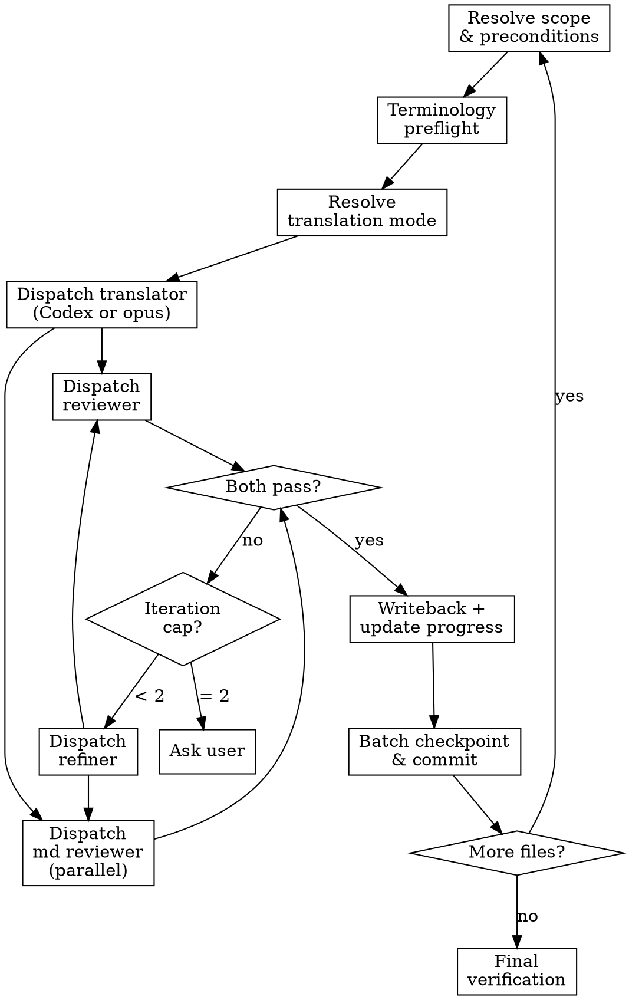

# Super Translate

## Overview

Iterative translation pipeline: `translator → reviewer → md-reviewer → refiner` (max 2 iterations).

**Core principle:** No overwrite unless reviewer passes. Draft isolation until quality confirmed.

**Markdown rule:** Source block shape is binding. Translators and refiners must preserve block order and block type, not just the wording.

## 模型路由（固定，勿依會話模型浮動）

| 角色 | model 參數 | 理由 |
| --- | --- | --- |
| translator | opus | 初稿品質決定迭代輪數 |
| reviewer | opus | 品質裁判需要最強模型 |
| md-reviewer | haiku | 清單式結構核對，無需判斷力 |
| refiner | sonnet | 執行 reviewer 的具體修改清單 |

## Progress Tracking

Authoritative state lives in `data/translation-progress.json`, kept in sync via `progress_edit.py`/`progress_read.py` at each step below — this is what later runs and other skills read, and it survives across sessions.

If a task-tracking tool is available in this session, mirror per-file progress into it for visibility (one task per target file with draft/review/refine/writeback sub-steps, one for batch checkpoint, one for final verification). Treat it as optional visibility on top of the progress file, not the source of truth.

## The Process

### Step 1: Resolve Scope and Preconditions

1. Verify required files: `data/translation-progress.json`, `glossary.json`, `style-decisions.json`. Stop if missing.

2. Resolve target files:
   - `$ARGUMENTS` specifies files → use directly.
   - No args / `all` / `next` → auto-select using progress script:
     ```bash
     uv run python scripts/progress_read.py --next 5 --json
     ```
     1. Select files with status `not_started`, in chapter order. Default batch = 5 files.
     2. If user explicitly requests resume → include `in_progress` files: `--status in_progress`.
     3. Display and confirm:
        ```
        翻譯進度：已完成 X / Y 個章節
        本批次自動選取以下 N 個檔案：
        - [in_progress 繼續] <file>
        - [not_started 新增] <file>
        是否繼續？或請指定其他範圍。
        ```

3. Resolve the project's Codex draft-tiering preference per `../translate/codex-tier.md` §1 (asked once per project, then silent). This only affects the translator step (Step 4) — reviewer, md-reviewer, and refiner stay as specified in the model routing table above regardless.

**Verification:** Target file list confirmed by user; all 3 required files exist; Codex tiering preference resolved.

### Step 2: Terminology Preflight (Fail-Closed)

```bash
uv run python scripts/validate_glossary.py
uv run python scripts/term_read.py --fail-on-missing --fail-on-forbidden
```

If fails → stop and fix terminology first.

**Verification:** Both commands exit 0 with no missing/forbidden terms.

### Step 3: Resolve Translation Mode

Read `style-decisions.json.translation_mode.mode`. If missing, ask user:
- **完整翻譯**：完整翻譯所有內容，保留原始結構與細節
- **摘要翻譯**：精簡翻譯重點規則，省略範例與冗長說明

**Verification:** `translation_mode.mode` is persisted in `style-decisions.json`.

### Step 4: Pipeline Execution

**Pre-read shared context once per batch:**
- `GLOSSARY_CONTENT` = `glossary.json`
- `STYLE_CONTENT` = `style-decisions.json` (includes `translation_notes` as hard constraints)

**For each target file, run the pipeline:**

1. If using task tracking, update the item → `in_progress`; update progress:
   ```bash
   uv run python scripts/progress_edit.py --file <TARGET_FILE> --status in_progress
   ```
2. Read source content; resolve draft path:
   ```bash
   uv run python scripts/draft.py --skill super-translate path <TARGET_FILE>
   ```
3. **Dispatch translator:**
   - If Codex tiering is enabled and available (`../translate/codex-tier.md` §2), delegate to Codex per `../translate/codex-tier.md` §3, using `./translator-prompt.md`'s constraints and required-output shape as the `--output-schema`. On any Codex failure, fall back to the Agent-tool dispatch below per `../translate/codex-tier.md` §5.
   - Otherwise (or on fallback): **Dispatch translator** (Agent tool, general-purpose, **model: opus**) using `./translator-prompt.md`
     - Inline all context: source, glossary, style, draft path
     - Translator must not read files; all context is pre-inlined
   - Either way, the translator step must complete a block-shape self-check before the pipeline continues: frontmatter, heading levels, list structure, blank-line boundaries, tables, code fences, admonitions, images, and MDX/import blocks must still align with the source
4. Read draft content after the translator step returns
5. **Dispatch reviewer and Markdown reviewer concurrently** — the two gates check independent things (translation fidelity vs. Markdown structure) and neither needs the other's output, so issue both dispatches in the same message and wait for both:
   - **Reviewer** (Agent tool, general-purpose, **model: opus**) using `./reviewer-prompt.md`
     - Inline: source, draft, glossary, style
   - **Markdown reviewer** by invoking the `md-review` skill (Agent tool, general-purpose, **model: haiku**) using `../md-review/reviewer-prompt.md`
     - Inline: source, draft, glossary, style, project conventions from `.claude/rules/docs-conventions.md`
     - This gate checks Markdown structure, frontmatter, heading hierarchy, block boundaries, lists, tables, links, image syntax, Starlight syntax, and zh-TW style rules
6. If either reviewer fails → **dispatch refiner** (Agent tool, general-purpose, **model: sonnet**) using `./refiner-prompt.md`
   - Inline: source, draft, translation review JSON, md review JSON, glossary, style
   - Refiner must repair structure before wording polish when Markdown findings exist
   - Re-read draft → re-dispatch reviewer and Markdown reviewer concurrently (same as step 5). Cap at 2 total iterations.
7. If 2 iterations still fail, ask user:
   - **保留草稿，稍後手動修正**
   - **停止此檔案，先處理術語、格式或規則歧義**

**Unknown terms:** Run `term_edit.py --set-zh` workflow, then rerun file.

**Parallel dispatch:** When batch has 2+ independent files and no shared terminology conflicts, dispatch multiple translator steps concurrently — multiple `Agent`-tool calls, or multiple `codex exec` subprocesses if Codex-routed. If Codex-routed, cap concurrent `codex exec` processes independently of Agent-tool concurrency (start with 2-3 at a time) to avoid local resource or rate-limit pressure; reduce further on repeated failures. Reviewer/refiner remain sequential per file regardless.

**Verification:** Per file: reviewer JSON and md-review JSON both return `"pass": true`, and no block-shape mismatch remains; otherwise iteration cap reached and user consulted.

### Step 5: Controlled Writeback

Only if reviewer passes:
```bash
uv run python scripts/draft.py --skill super-translate writeback <TARGET_FILE>
```

**Immediately** update progress:
```bash
uv run python scripts/progress_edit.py --file <TARGET_FILE> --status completed
```
If using task tracking, update the item → `completed`.

If blocked: keep source unchanged, status stays `in_progress`; if using task tracking, mark the item blocked.

**Verification:** Writeback script exits 0; `progress_edit.py` exits 0; `data/translation-progress.json` shows the file `completed`.

### Step 6: Batch Checkpoint

After each batch:
1. Report: completed/blocked count, iteration counts, `已完成 X / Y 個章節`
2. Stage only batch-touched files and commit:
   ```bash
   git commit -m "progress: X/Y"
   ```
3. If remaining files exist → ask user to continue (re-run Step 1) or proceed to verification.

**Verification:** `git log -1` shows checkpoint commit with `progress: X/Y` message; report displayed to user.

### Step 7: Final Verification (MANDATORY, cannot be skipped)

```bash
uv run python scripts/validate_glossary.py
uv run python scripts/term_read.py --fail-on-missing --fail-on-forbidden
```

**Always invoke the `check-consistency` skill next, unconditionally** — this is the step that catches terms approved *after* an earlier file in this same run (or a prior run) was already translated; per-file review alone cannot catch that drift. Do not skip this because the batch "looked clean" or the run is taking a while.

If `check-consistency` reports zero violations → mark the run complete.

If `check-consistency` reports any violations → **stop. Do not silently fix and continue, and do not mark the run complete.** Report the violations to the user and ask:
- **現在修正**：套用術語替換，重新驗證
- **記錄下來，稍後統一處理**：先結束本次執行，違規清單留給下次術語決策時處理

**Verification:** Both validation commands exit 0; `check-consistency` was actually invoked (not assumed clean) and either reports zero violations or the user has explicitly chosen how to proceed; all tasks marked `completed`.

## Prompt Templates

Colocated with this skill. Orchestrator inlines all placeholders before dispatch:
- `./translator-prompt.md` — draft generation
- `./reviewer-prompt.md` — source fidelity + translation quality check
- `../md-review/reviewer-prompt.md` — markdown structure + style compliance check
- `./refiner-prompt.md` — apply both review streams

## Flowchart



## Progress Sync Contract

1. Sync `data/translation-progress.json` (via `progress_edit.py`), and the task list if one is in use, at file start, every review loop, and file close.
2. NEVER defer sync until end-of-run.
3. Create batch checkpoint commit immediately after each completed batch.

## Red Flags

| Thought | Reality |
|---------|---------|
| "Just overwrite source, reviewer will pass next time" | Draft isolation exists for a reason. NEVER overwrite without pass. |
| "Skip task updates until the end" | Sync contract is per-file, not per-run. |
| "I'll invent a translation for this unknown term" | Run `term_edit.py --set-zh` workflow. No exceptions. |
| "Skip terminology preflight, it was fine last time" | Glossary changes between runs. Always preflight. |
| "One file left, no need for checkpoint commit" | Every completed batch gets a commit. No exceptions. |
| "I can batch-replace with regex for speed" | Manual translation only. Script-generated prose is forbidden. |
| "Codex wrote this draft, skip the reviewer/md-reviewer gate" | Both gates are unconditional regardless of which path produced the draft. |

## When to Stop and Ask

- Repeated critical findings remain after iteration cap
- Subagent output is malformed and not safely recoverable
- Unknown term requires user decision (rare characters, puns, culturally nuanced)

## Next Step

If `uv run python scripts/progress_read.py` shows all files are `completed` after this batch, invoke the `final-proofread` skill to run the three-gate quality sweep before publishing.

## References

See `./translator-prompt.md`, `./reviewer-prompt.md`, `../md-review/reviewer-prompt.md`, and `./refiner-prompt.md` for full dispatch context and placeholder specifications.
