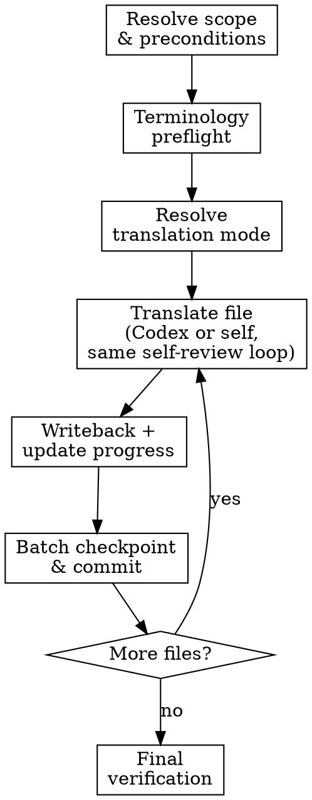

# Translate Document

> 模型建議：本技能為主執行緒流程，依成本路由決策建議於 **sonnet** 會話執行；高階模型會話亦可執行，但屬超規格花費。

## Overview

Single-pass translation of markdown content to Traditional Chinese with glossary compliance, draft isolation, progress tracking, and one Git checkpoint commit per completed batch.

**Core principle:** Draft first, verify before writeback, never overwrite source with unverified output.

## Progress Tracking

Authoritative state lives in `data/translation-progress.json`, kept in sync via `progress_edit.py`/`progress_read.py` at each step below (see Progress Sync Contract) — this is what later runs and other skills read, and it survives across sessions.

If a task-tracking tool is available in this session, mirror per-file progress into it for visibility (one task per target file, one for batch checkpoint, one for final verification). Treat it as optional visibility on top of the progress file, not the source of truth.

## The Process

### Step 1: Resolve Scope and Preconditions

1. Verify required files exist:
   - `glossary.json`
   - `style-decisions.json`
   - `data/translation-progress.json`
   If any are missing, stop and ask user to run `/init-doc` first.

2. Resolve target files:
   - If `$ARGUMENTS` specifies concrete file paths or a scoped pattern → use those directly as the current batch.
   - Otherwise (no args, `all`, or `next`) → **auto-select using progress script**:
     ```bash
     uv run python scripts/progress_read.py --next 5 --json
     ```
     1. Select files with status `not_started`, in chapter order.
     2. If user explicitly requests resume → include `in_progress` files: `--status in_progress`.
     3. Display selected files to user in Traditional Chinese before proceeding:
        ```
        翻譯進度：已完成 X / Y 個章節
        本批次已從進度表自動選取以下檔案：
        - [in_progress 繼續] <file>
        - [not_started 新增] <file>
        …
        是否繼續？或請指定其他範圍。
        ```
     4. Wait for user confirmation or override.
   - The selected target set for this run is one batch. If only one file is selected, that single file is the batch.

3. Resolve the project's Codex draft-tiering preference per `./codex-tier.md` §1 (asked once per project, then silent).

**Verification:** Target file list confirmed; all required files exist; Codex tiering preference resolved.

### Step 2: Terminology Preflight (Fail-Closed)

```bash
uv run python scripts/validate_glossary.py
uv run python scripts/term_read.py --fail-on-missing --fail-on-forbidden
```

If preflight fails, stop and fix terminology first.

**Verification:** Both commands exit 0.

### Step 3: Resolve Translation Mode

Read `style-decisions.json.translation_mode.mode`.
If missing, ask user in Traditional Chinese:
- **完整翻譯**：完整翻譯所有內容，保留原始結構與細節
- **摘要翻譯**：精簡翻譯重點規則，省略範例與冗長說明

Persist mode before translating.

**Verification:** `translation_mode.mode` persisted in `style-decisions.json`.

### Step 4: Prepare Draft Directory

For each target file, obtain its draft path (this also creates the directory):

```bash
uv run python scripts/draft.py --skill translate path <TARGET_FILE>
```

Use the printed path as `<DRAFT_FILE>` for that file.

**Verification:** Draft path returned; directory exists.

### Step 5: Translate Per File

For each target file:

1. If using task tracking, mark the item `in_progress`
2. Update progress:
   ```bash
   uv run python scripts/progress_edit.py --file <TARGET_FILE> --status in_progress
   ```
3. Read source content, `glossary.json`, and `style-decisions.json`（特別包含 `translation_notes`）
4. Get draft path:
   ```bash
   DRAFT_FILE=$(uv run python scripts/draft.py --skill translate path <TARGET_FILE>)
   ```
   Draft/source mapping is stored in `.state/translate/draft-manifest.json`; do not add translation metadata to frontmatter. Do NOT overwrite source file; write only to `$DRAFT_FILE`.

   If Codex tiering is enabled and available (`./codex-tier.md` §2), delegate generating `$DRAFT_FILE` to Codex per `./codex-tier.md` §3, inlining the constraints below into the prompt. On any Codex failure, fall back to translating it yourself per `./codex-tier.md` §5.

   Otherwise (or on fallback), translate to `$DRAFT_FILE` yourself:
   - Traditional Chinese only (Taiwan usage), no Simplified Chinese
   - Preserve markdown structure exactly (frontmatter, headings, lists, tables, links, code blocks)
   - Follow every applicable note in `style-decisions.json.translation_notes`
   - Treat `frontmatter.title` as the page title; do not restate it anywhere in the body as a heading of any level (`#`, `##`, etc.)
   - If the source page opens with an overview/introduction block that has no heading, translate it as plain body content; do not invent a `#` or `## 概覽` heading
   - Preserve image links exactly; if an image link appears within the source flow for a paragraph, keep the same link but place it near the middle of the translated paragraph instead of splitting the paragraph into separate blocks
   - Use glossary mappings exactly
   - Manual translation only (no script-generated prose)
5. Self-review the draft against source — this step is unconditional and identical whether Codex or you generated `$DRAFT_FILE`:
   - Missing or truncated content?
   - Glossary violations?
   - Violated any item in `style-decisions.json.translation_notes`?
   - Markdown structure broken?
   - Added any heading of any level that simply restates `frontmatter.title`?
   - Added `概覽`/overview heading that does not exist in the source?
   - Image links preserved and kept inside the paragraph flow without splitting the paragraph?
   - Full-width punctuation correct?
   - Content contamination: any paragraph or block that has no corresponding source in the original file?
   - Untranslated English: any English left untranslated (excluding code/dice notation such as `1d6`, `+2`)? Covers body text, headings, table cells, and game labels (status conditions, item tags, rule keywords/phrases). Terminology must match `glossary.json`; proper nouns follow `style-decisions.json` policy.
   - Native Chinese quality: any sentence that keeps English clause order/structure instead of natural Chinese syntax? Any 四字成語 or literary flourish that isn't grounded in the source's meaning? Any technical term translated where `glossary.json` or `style-decisions.json` says to keep the original English form?
   - Fix any issues found in the draft directly
6. Writeback:
   ```bash
   uv run python scripts/draft.py --skill translate writeback <TARGET_FILE>
   ```
7. **Immediately** update progress:
   ```bash
   uv run python scripts/progress_edit.py --file <TARGET_FILE> --status completed
   ```
   Do NOT defer this update; run it before moving to the next file.
8. If using task tracking, mark the item completed

**Unknown term handling:**

```bash
uv run python scripts/term_edit.py --term "<TERM>" --set-zh "<ZH>" --status approved --mark-term
uv run python scripts/term_read.py --fail-on-forbidden
```

Then continue translating with the updated glossary.

**Verification:** Self-review checklist passes; writeback exits 0; progress JSON updated.

### Step 6: Batch Checkpoint Commit

After all files in the current batch are processed:

1. Run `git status --short` and verify batch scope before staging.
2. Stage **only** files touched by this batch:
   - completed translated source files from this batch
   - `data/translation-progress.json`
   - `glossary.json` if changed in this batch
   - `style-decisions.json` if changed in this batch
3. Create one checkpoint commit for the batch:

```bash
git commit -m "progress: X/Y"
```

4. Commit message rules:
   - keep it short and progress-only
   - use the current completion count from `uv run python scripts/progress_read.py --json`
   - do not mention filenames, rationale, or extra prose
5. Never stage or commit unrelated user changes.
6. If no file reached `completed` in this batch, skip the commit.

**Verification:** `git log -1` shows progress commit.

### Step 7: Final Verification

```bash
uv run python scripts/validate_glossary.py
uv run python scripts/term_read.py --fail-on-missing --fail-on-forbidden
```

If using task tracking, mark the final verification item completed.

**Verification:** Both validation commands exit 0; `data/translation-progress.json` shows all target files `completed`.

## Flowchart



## Progress Sync Contract (Required)

1. Sync `data/translation-progress.json` (via `progress_edit.py`), and the task list if one is in use, at file start and file close.
2. Never defer sync until end-of-run.
3. Create the batch checkpoint commit immediately after batch completion; do not postpone it to a later batch.

## Red Flags

| Thought | Reality |
|---------|---------|
| "Just overwrite source, I'll review later" | Draft isolation exists for a reason. NEVER overwrite without self-review. |
| "Skip task updates until the end" | Sync contract is per-file, not per-run. |
| "I'll invent a translation for this unknown term" | Run `term_edit.py --set-zh` workflow. No exceptions. |
| "Skip terminology preflight, it was fine last time" | Glossary changes between runs. Always preflight. |
| "One file left, no need for checkpoint commit" | Every completed batch gets a commit. No exceptions. |
| "I can batch-replace with regex for speed" | Manual translation only. Script-generated prose is forbidden. |
| "I'll add a heading to restate the title" | Never restate `frontmatter.title` as a body heading. |
| "I'll add an overview heading for clarity" | Never invent a heading that does not exist in the source. |
| "Codex wrote this draft, skip the self-review" | Review is unconditional regardless of who/what generated the draft. |

## When to Stop and Ask for Help

Stop when:
- mode policy is unclear
- source text ambiguity changes mechanics meaning
- repeated terminology conflicts block translation integrity

## When to Revisit Earlier Steps

Return to Step 1 or 3 when:
- target scope changes
- translation mode changes
- glossary decisions change materially

## Next Step

After translation, run `/check-consistency` and `/check-completeness` as needed.

If `uv run python scripts/progress_read.py` shows all files are `completed` after this batch, invoke the `final-proofread` skill to run the three-gate quality sweep before publishing.

## Example Usage

```text
/translate
/translate docs/src/content/docs/rules/basic.md
/translate rules
/translate all
```
